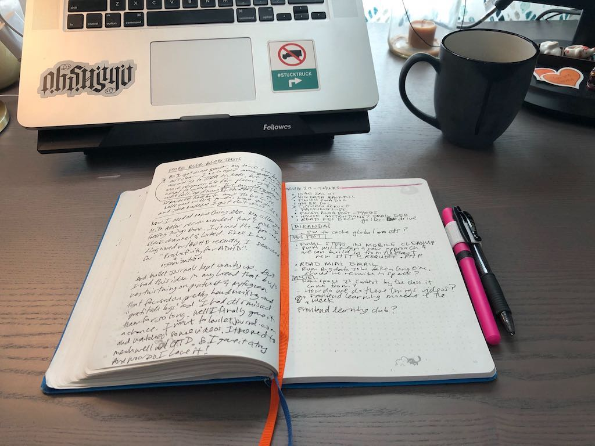
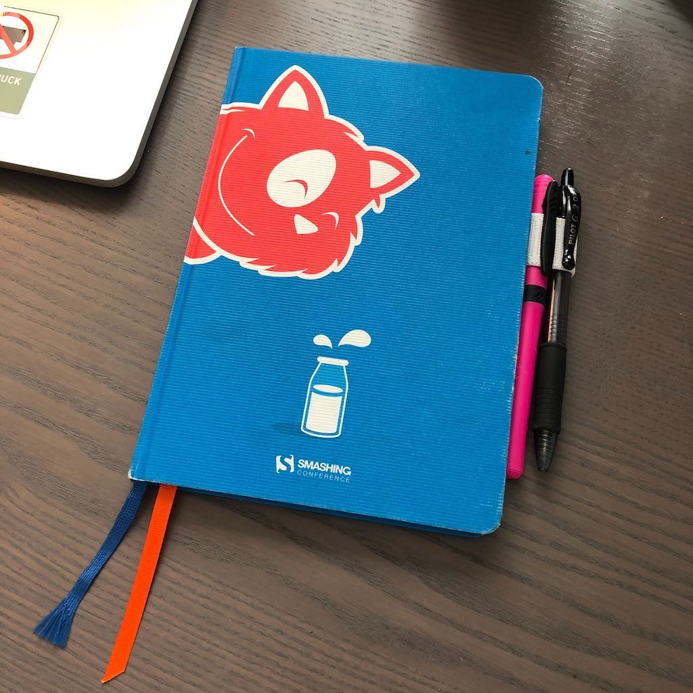
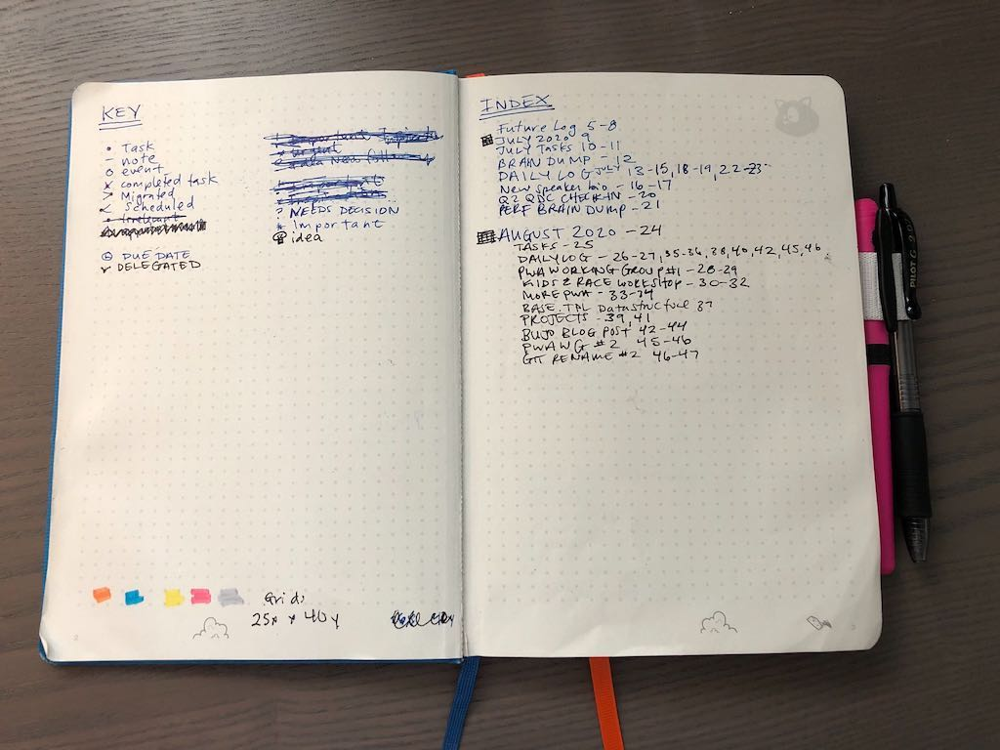
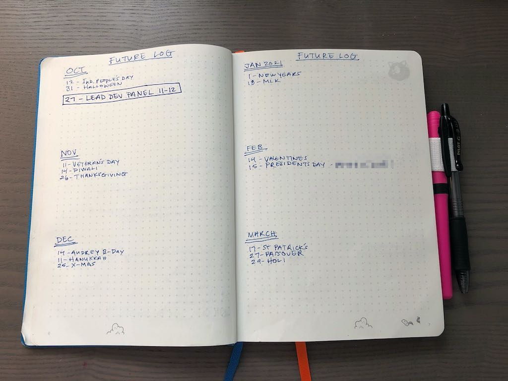
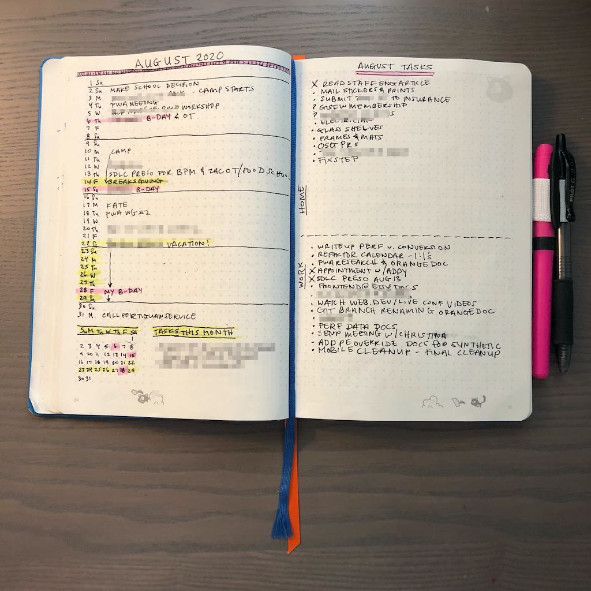
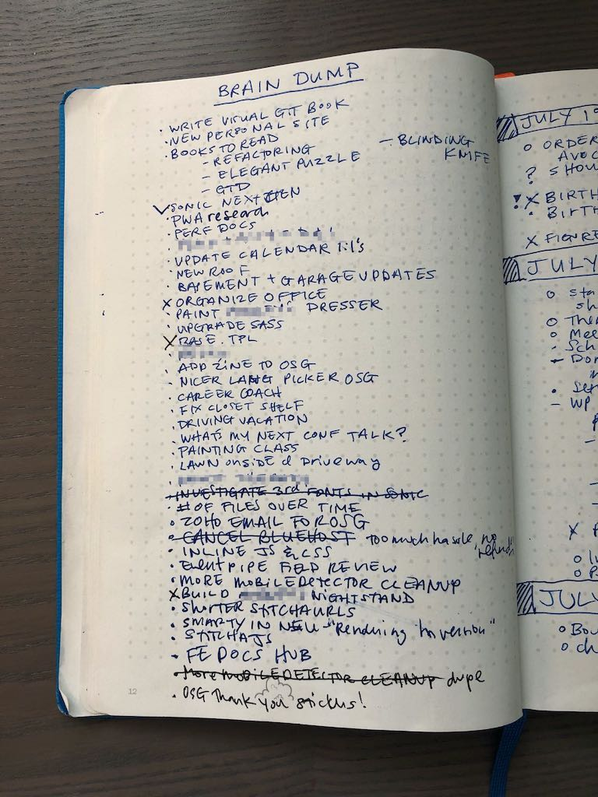
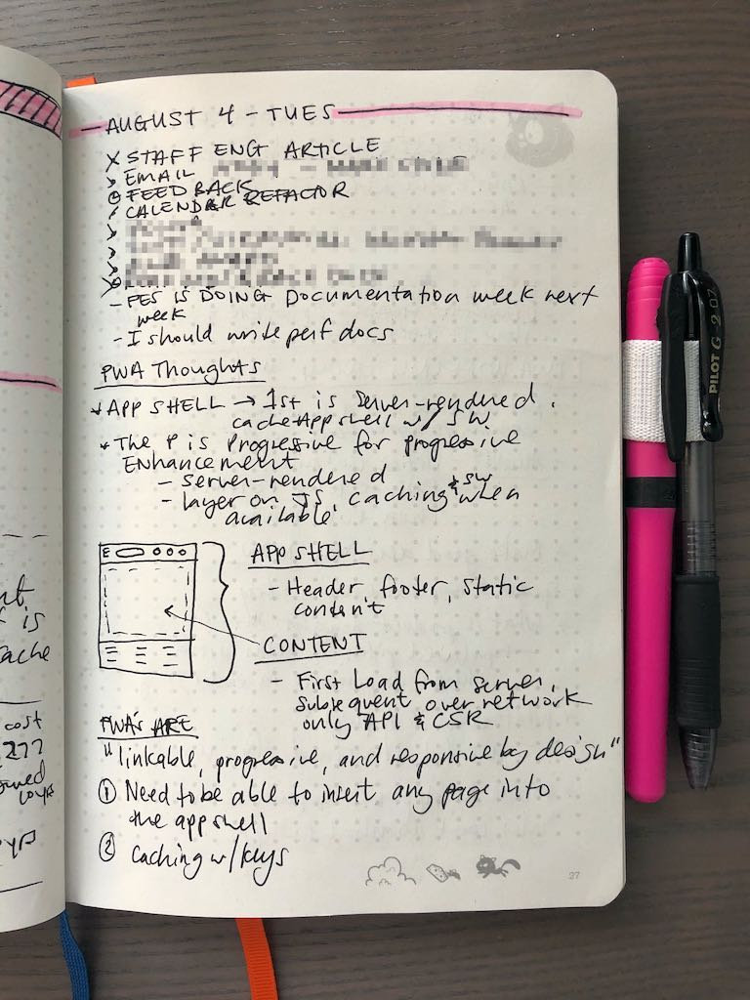
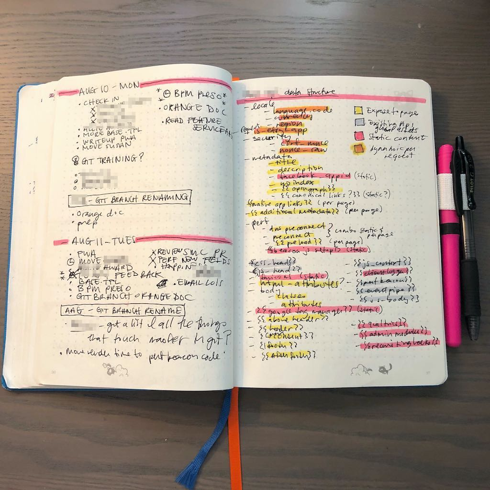
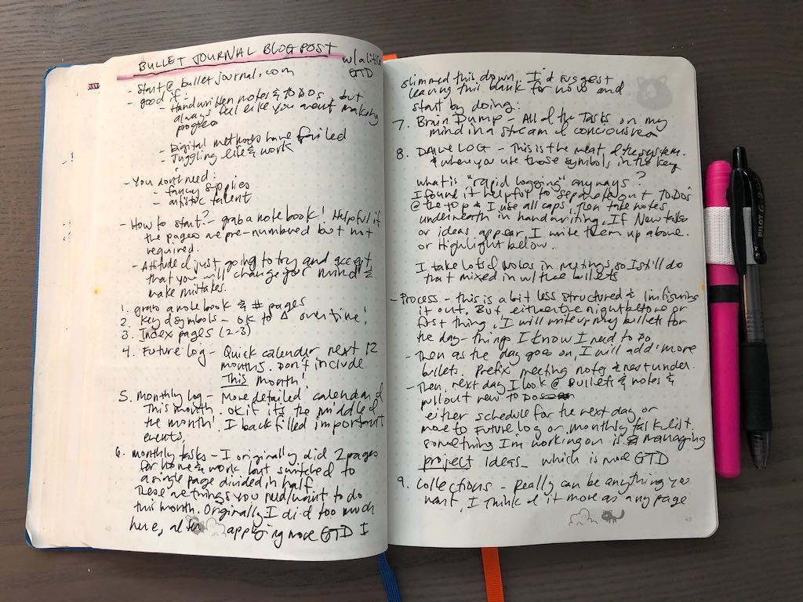
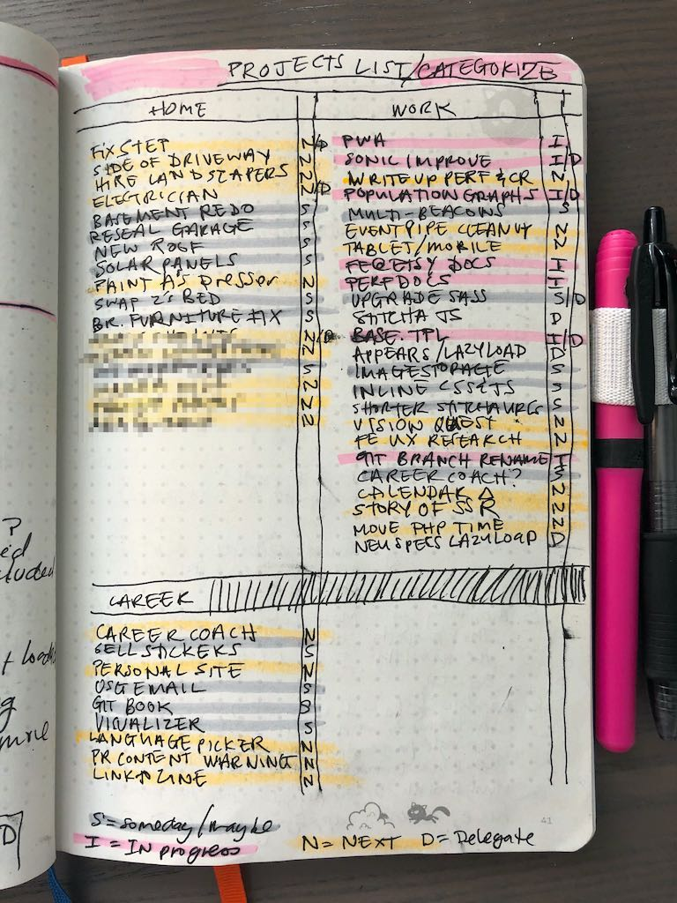

---
layout: post
title: Bullet journalling for software engineers (and other not-necessarily-artistic people)
--
# Bullet journalling for software engineers (and other not-necessarily-artistic people)

If you, like me, frequent Pinterest and Instagram, you've probably got the wrong idea about Bullet Journals. For the last several years I've come across dozens of perfectly-styled photos of beautifully illustrated motivational phrases handwritten in the pages in a fancy leather-bound notebook, with artist-grade pens and markers or highlighters placed ever so slightly off-parallel to give that perfect "I just happened to take a picture of my desk in it's natural state" vibe. Based on these images, I thought Bullet Journals were pretty and fluffy - good for artists, but not particularly applicable to my life as a software engineer. However, after doing some research and  actually using the system myself for about a month now, I can unequivocally say that the perception I had was totally wrong. 

A Bullet Journal _isn't_ a perfectly-designed show-off piece just for influencers and lifestyle bloggers; it _is_ a proven organizational system based on a simple note-taking practice which anyone can use to help tame the chaos of their life and work. I've been using a Bullet Journal for a little over a month now, and it's been incredibly helpful for me to get on top of my endless to-do list and ensure that I'm doing the right things at the right time, and, most importantly, I feel like I'm more in control of the chaos. I love my Bullet Journal, and if you are anything like me, I think you will love it too!

## Why Bullet Journalling?

The biggest reason I decided to give Bullet Journalling a try was because of how well it seemed to work for other people with ADHD. For _decades_ I saw my inability to "just get organized" as a personal failure, it seemed so easy for other people, why not me? Since being diagnosed with ADHD as an adult, I've learned to accept that it's not that I'm lazy or lacking willpower, my brain just works differently! Ryder Carroll has written about [how he created the Bullet Journal system to help manage his ADHD brain](https://humanparts.medium.com/inside-adhd-55b9618cd708) - he eloquently calls it "catching the rain".

The second reason that I chose Bullet Journaling is that it is a _paper-based_ system. Over the years, I've tried all the hot new digital productivity apps - Evernote, Clear, Todoist, Notion, Trello - but despite my good intentions, I never managed to use any of them for more than a day or two. Looking back, digital methods never worked for me because I have been and always will be an analog note-taker. I have notebooks going back many years that are chock full of notes from most of my meetings, conferences, brainstorming sessions, to do lists, random thoughts, etc. Turns out that researchers believe handwriting helps aid in memory and retention, so all those years I was unknowingly helping my ADHD brain overcome it's difficulty with short-term memory! When I started looking for help to tame my seemingly neverending to-do list, I knew I had to find something that worked with my analog nature, not against it.

## The core system

The beauty of the Bullet Journal system is that it's completely flexible, but it's not totally structureless. The core Bullet Journal system uses just a notebook and pen or pencil (if you are more of a typed notes person, you can totally do bullet journaling digitally!), you then add your own, minimal organization. Unlike with a traditional paper planner, there is no guilt that you missed a day, or that you didn't fill out the calendar for that month, or that the kinds of notes you want to take don't fit into the structure of the page in front of you. But, there's _just enough_ structure so that you don't feel like you are endlessly circling without moving forward in tackling the items on your to-do list. And, the best part is that you can start on any day you like, no worries about buying a planner for the year and having to leave multiple days or months blank (yes the very thought of doing this causes me high anxiety!).

The official [bulletjournal.com](https://bulletjournal.com) website has a great series of easy to follow tutorials and videos that lay out the basics of the system, but, in software terms, it's more like an API reference. What I really wanted to find was a cookbook that laid out the lifecycle and flow of the application. In my googling to try and learn more in detail about how to get started and actually use the system in real life, it was hard to find something that felt like it was speaking to my situation - I'm not planning out a month's worth of blog posts and social campaigns (although I probably should)! I'm wrangling multiple work-related projects, career commitments, and deadlines _plus_ a family stuck at home due to COVID. So, I cobbled together what I could from various sources around the internet, and dove in. This blog post outlines how I think about and use my Bullet Journal, and hopefully provides to you, dear reader, that cookbook that I was looking for and couldn't find. (To be fair, I've been told that the "official" book has more detail on the actual process, so it is next up on my reading list!)

## Bullet Journal + Getting Things Done = extra success?

Around the same time that I started bullet journalling, I had just started reading the book _Getting Things Done_ by David Allen, and I've been taking pieces of the GTD productivity system and applying it to my Bullet Journal practice. I haven't finished reading the book (it's a bit of a slog before you get to the meat of the system TBQH), but I've noted below where I've found that layering on pieces of the GTD system have helped to refine or improve pieces of my Bullet Journal. You can visit the [GTD Website](https://gettingthingsdone.com/) if you are interested in learning more.

## Getting started

The easiest way to get started is to just grab a notebook and do it! You don't need artistic talent and you don't have to be perfect - you can cross things out, cut out pages and re-do them, try new things, figure out what works for you (and what doesn't), and continually refine your process. As you will see, my usage changed even during this first month, and it will continue to change.

I also highly recommend that you first visit [the "learn" section of bulletjournal.com](https://bulletjournal.com/pages/learn) - watch the 5 minute tutorial video, then read through the whole page to get more in-depth on each piece of the system. I'll go over all of the pieces again below, but with more of a focus on how I think about and use each component of the system.

## Set up your notebook

I sat down in front of the TV one evening with a notebook and pen while I cross-referenced bulletjournal.com on my phone. It took me about an hour (most of which was spent filling in birthdays & holidays in the future log), but you can do it in a shorter time if you want to get going quickly.

<ol>
<li><strong>Grab a notebook and a writing implement</strong>

Any blank notebook that you have on hand will do! It's helpful if the notebook is small enough to be carried around with you - A5 (approx 5" x 8.5") is a good balance of carry-ability and writing space. Dotted or grid pages are helpful for drawing straight(er) lines, and pre-numbered pages will allow you to cut out step 2, but neither are a requirement. Same with bookmarks, if your notebook has 1 or more built-in ribbon bookmarks, great! If not, you can improvise with post-it notes or paper.

When I started, I looked through my treasure trove of conference swag and chose an A5 sized notebook from Smashing Conference that has pre-numbered, dotted pages and a single ribbon bookmark. As you can see from the photos, I made a few simple modifications over the course of the month - I superglued a second ribbon inside the back cover, and I used some wide elastic leftover from a tutu-making project to sew a pen holder loop and superglued that in too. 

For writing implements, any pen or pencil is great! I started out with a blue pen, misplaced that, and switched to black. After a week or two I added in some highlighters to help with visual "pop" and easier scannability, but they definitely are not required.
</li> 

<li><strong>Number the pages of your notebook</strong>

I lucked out and had a pre-numbered notebook. If you aren't so lucky, number each page yourself. Do not stop and search for a new notebook.
</li>

<li><strong>Add a Key of symbols to the first page or inside cover as a reference</strong>

This is an extension of the core system that I found in my searches online, and I think it's super helpful for a beginner. At base, I use the classic "Rapid Logging" symbols from the original system, and I've added (and subtracted) a few of my own.  As you can see from all the scribbles and crossing out, the symbols I've used have changed over time. Feel free to use mine, or create your own based on your needs.

**Rapid logging symbols:**
 (&bull;) = task
 (&mdash;) = note
 (&omicron;) = event

**Task states:**
 (x) = completed
 (&gt;) = migrated
 (&lt;) = scheduled
 <strike>strikethrough</strike> = irrelevant
 (&or;) = delegated

**Signifiers:**
 (&lowast;) = important
 (?) = needs decision
 (clock) = due date
 (lighbulb) = idea

I also used this page to note the number of rows and columns in the grid to help me layout pages evenly. 
</li>

<li><strong>Add an Index page</strong>

The Index really ties the whole joutnal together. You can add anything you want to the Index, so you can refer back to any information you need, and _nothing gets lost_, brilliant! Add the title "Index" to the top of the page, but leave the rest blank for now, we'll come back and fill it in in the next steps. Skip the next page or two to leave space for your index to grow.
</li>

<li><strong>Add a Future Log for the next 12 months</strong>

The Future Log is a simplified calendar view of the entire year. Add a block for each month, starting with *next* month (I didn't realize this when I filled out mine, and added the current month but didn't actually need it). Because I am a perfectionist, I counted the number of horizontal rows per page and divided that by three to have three months per page, which took up a total of 4 pages. Flip back to your Index and add an entry for your Future Log (e.g. "Future log: 5-8"). 

The future log is the place to note events and commitments that are happening or need to happen in a specific month. I have my digital calendar where I keep track of my detailed day-to-day schedule of work meetings and personal appointments, so I don't use the future log for *everything*. David Allen gives a great bit of advice in GTD that you should only putting things in your calendar for the month that you absolutely have to do during that month. So, I only add stuff with a specific date component: deadlines, reminders to follow up with someone, upcoming conference talks, vacations, etc. 

I also added holidays and birthdays to my furture log, which in some months takes up a lot of space, so I will probably try a different layout for my next future log adding only two months per page. Tracking down birthdays and holiday dates took up the longest part of my setup time, so you can skip this and/or come back to it.
</li>

<li><strong>Add a Monthly Log for this month</strong>

Remember how we skipped this month in the future log? Well, that's because we are going to add in a whole-page calendar for this current month with a ton more detail as it's own page. If it's the middle or end of the month, that's okay! I started halfway through the month, so I filled out the entire page, and then backfilled some important events from the previous weeks. I used the OG Bullet Journal layout for this page, with the month as the page title, then marking each day on a new row, annotated by the day of the week. I added a line across between saturday and sunday to visually scan the weeks. 

Then, in the empty space below I added the most important but not date-reliant tasks to finish for the month. But, to be honest I lose track of those tasks because they aren't on my Monthly Task list (see step 6 below), so next month I will leave that off. I also added a mini calendar by week, based on some designs in my Pinterest feed, but eh, it doesn't really add anything to the original layout. 

Don't forget to add this month as an entry in your index!
</li>

<li><strong>Add a Monthly Tasks page for this month</strong>

I originally had two pages, one for work tasks and one for home/personal tasks, but it was weirdly _too much room_ because I ended up adding a lot of ideas and tasks that I didn't get to, which was disheartening when it was time to review my task list before the next month. So, the second month, I slimmed this down to a single page split it in half between work and home (as seen in the photo above). As part of adding more GTD thinking to my approach, I'm trying to only add things to this list if they are a priority or if I absolutely _need_ to get these things done this month.

Add this page to your Index and learn from my trial & error - indent this entry (and everything else for the month) under the current month's entry so you can more quickly scan the list of pages in the Index. 
</li>

<li><strong>Start a Brain Dump page</strong> (This isn't "classic" bullet journal but something I added, so this step is optional)

The first major step of the GTD system is the "Capture" phase, where you take all of the things and get them into a single location - something that the author of GTD calls "closing the open loops". If you have endless tasks and projects swirling around your brain, then you are expending valuable mental energy keeping those "loops" open. Writing things down and organizing them in a system that you trust allows you to "close the loop", stop worrying about that task, and use your brainpower for actually completing tasks. 

To that end, I started my Journal by filling out a Brain Dump page with all of the random things that were swirling around in my head in an unfiltered stream of conciousness list that I could come back to and "Process" later on in the next phase of GTD. Having this list was really helpful for filling out my initial Monthly Task list. And of course, add this page to your Index! 
</li>

<li><strong>Start your first Daily Log</strong>

This is the meat of the whole system and where you will use those symbols we definined in the key page. Start each day with a header - I usually do it in the format of `AUG 4 - TUES`. I tried some different ways to visually highlight the day header, and I've landed on drawing a simple horizontal line with a little strip of pink highlighter on top, because the color helps to visually distinguish the beginning of a new day. 

Start your log for today by retroactively logging some events (circles) and/or tasks (dots) that you've completed and x-ing them out to give yourself a nice feeling of accomplishment - if you can't think of anything you've done today, may I remind you that you started a bullet journal! Then add any uncompleted tasks or events still to happen. Use signifiers where appropriate to add extra meaning to each log item.

Don't pre-generate your next Daily Logs for future days, wait until you've completed the day before you draw a line & start the next day.
</li>
</ol>

## The process

Now that your notebook is all set up, let's talk about the process of using this thing you've just created. This was one of the harder things to learn about beforehand, which was super frustrating. I wanted to know the exact details of when and how other people used this system in real life! 

The foundation of the Bullet Journal process is really to write everything down. I mean EVERYTHING. By far the biggest improvement it's made to my productivity is that it's one notebook to rule them all, no more multiple notebooks and pads and sticky notes scattered around my house and office. Because I put everything in one place, I close those open loops and I can trust that if I need to do something, it's written down in my journal and I won't forget it. My journal functions almost like an external brain.

<ol>
<li><strong>Daily Logging</strong>

At first, getting the hang of the Daily Log was the biggest challenge for me, and I definitely went through some fits and starts while I figured out how to effectively use it. The system I've landed on to organize my Daily Log is to split out my pre-planned/known events and tasks at the top of the section using ALL CAPS so that it looks cleaner, fits on one line, and stands out visually. The signifiers really come in handy here to help me decide what tasks are the most important or time-sensitive tasks to complete. 

 

Then, I will switch to note-taking mode, where I'm not always "rapid logging" everything, but combining bullets and longer-form notes in a looser way. As I said before, I've been a note taker for a very long time, and I felt too constrained by the "rapid log" format, but you should try it and see if it works for you! 

If I'm taking notes from a meeting I will write out a sub-header and nest my longer-form notes underneath that as I always have, but un-nest any new tasks that might arise from the meeting so I can scan for them during my daily migration (see step 3). In cases where I've captured enough important meeting notes that I want to be able to refer back to them, I add the header & page number as a new "Collection" entry in my index, which brings me to the next step in the process. 
</li>

<li><strong>Collections</strong>

Collections are another part of bullet journaling that can feel intimidating, especially if you spend too much time looking on Instagram & Pinterest! I've found it helpful to think of a Collection as just a page full of stuff that you want to reference back to using the Index. So, it can be something specific - a brain dump, a project plan, a list of books you want to read - or something organic like notes from a meeting that you want to be able to refer back to. The notes that formed the basis of this blog post started out as a collection in my Bullet Journal!

</li>

<li><strong>Daily Migration</strong>

Migration is just a fancy word for evaluating your prior day and getting ready for the next day. So, either first thing in the morning or in the evening as I'm winding down my work day, I start a new Daily Log section for my new day. Then, I go back and look through my log from the prior day, marking up each task with it's current state. I will x out any bullets that I completed, then copy anything that I didn't complete (and still think is a priority) to the new day's list of tasks. Technically, you are supposed annotate these tasks with a "migrated" (&gt;) arrow to show that you moved it to the next day, but I'm not always great at remembering to do that! If something has a deadline or follow-up in the future, I move it into my Future Log and mark it as "scheduled" (&lt;). If there is something that I didn't complete and think that I should de-priorize, I will move it back into my Monthly Task list, or just cross it out as "irrelevant".

To finish filling out the new day's pre-planned list, I look at my Monthly Log and digital calendar to see if there are any upcoming deadlines or important meetings that I need to start working on or preparing for and add those to my Daily Log. Finally, I scan the monthly task list to cross off any tasks I completed that I had originally noted there, and to check if there are any other tasks to pull into my day.

This all sounds like a lot of work, but I've found that as it becomes more and more of a regular habit, it takes less and less time. When I'm more on top of my work and prioritizing things well, then it's generally easier to figure out what my next tasks are.
</li>

<li><strong>Weekends</strong>

I made the decision early on to use my bullet journal for _everything_ in my life. Especially with COVID quarantine, the separation between "work" and "home" is blurry at best! As I go through the work week, my daily tasks tend to be a mix of 85/15 work slash home/non-work and on weekends, my focus changes 100% to non-work tasks. 

As I mentioned above, to manage this combination I split out my Monthly Task list by context as a way to keep things organized. As home tasks come up throughout the week, I move them to my Monthly Tasks list the same as any work-related to-dos. On Friday night or Saturday morning, I will write out a combined Daily Log for Sat/Sun, pull a list of tasks, then mark them off and migrate them the same as during the work week. I've found with the Bullet Journal that I feel like my life is more under control because everything is in one place (one notebook to rule them all!), so I try my best to continue to carry my journal everywhere and write everything down, even on the weekends.
</li>

<li><strong>Monthly Migration & Setup</strong>

On the last day of the month, I set aside some extra time to set up a new Monthly Log and Monthly Task list for the following month (and add them to my Index), then I follow pretty much the same process as in a Daily Migration, just at the level of the whole month. First, I copy all of the entries for the new month from the Future Log into my Monthly Log. I also check my digital calendar for any important meetings, events or appointments and add them to the Monthly Log. Then, I will go through and reevaluate my Monthly Task list to migrate those forward, or move to the Future Log for another month.
</li>

<li><strong>A Note on Bookmarks</strong>

I started out with one bookmark that I used to mark my current page. That worked great for the first month! But when I got to the second month the monthly log was harder to find, so I added a second bookmark to leave in the Monthly Log for the current month, and continue to use the other to mark my current page. You can superglue some ribbons to the cover/spine like I did, or use sticky note(s) to mark both pages. The "official" Bullet Journal has three bookmarks(!!!) but I haven't gotten that far yet.
</li>
</ol>   

## What I'm still figuring out

While I absolutely love my Bullet Journal so far, I've found that one of the missing pieces in the "classic" system is a clear way to manage longer-term projects and ideas for the future (I have far too many ideas that don't see it to fruition!). Thankfully, this kind of capture, categorization, and execution is precisely what GTD focuses on, so I plan to continue layering on pieces of that system and incrementally improving my system for managing things that aren't discrete tasks. 

I started out by taking the projects from my Brain Dump list and categorizing them in a Project Categorization List. I divided a page into sections for Home, Career, and Work, then migrated items into the appropriate category. Then, I annotated each one according to it's status - In progress, Next up, Someday/Maybe and Delegate it. 

Next, I'm planning to add a new collection to my Journal for each project that is either in progress or next up, then use the guidance of the GTD system to list out discrete "Next Actions" that will move these projects forward.

## Give Bullet Journaling a try!

Hopefully all of this gave you a better sense of what a Bullet Journal is, and cleared up any misconceptions about what it isn't. If you found this post useful to help you get started, or if are a veteran Bullet Journaller and have advice on how to better manage longer-term ideas and projects, I would love to hear from you! You can reach me on Twitter @ksylor.

### Links & Resources
[BulletJournal.com](https://bulletjournal.com)

[GettingThingsDone.com](https://gettingthingsdone.com)

[The Art of Bullet Journaling and the Improved To-Do List - New York Times](https://www.nytimes.com/2018/12/27/books/how-to-bullet-journal.html)

[How ADHD Helped Me Create the Bullet Journal Method](https://humanparts.medium.com/inside-adhd-55b9618cd708)
